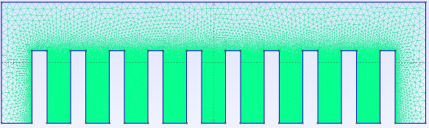

# Engineering Projects Portfolio
## Vaikunth Keshav Krishnan

---

## Project 1: CFD Heat Sink Optimization
**MCEN 4231/5231 - Computational Fluid Dynamics**

### Problem Statement
Electronic components generate heat that must be dissipated efficiently. Traditional heat sink designs use arbitrary fin spacing without optimization, leading to material waste and suboptimal cooling performance.

### Design Objective
Determine optimal fin spacing for passive heat sinks to maximize heat transfer rate while minimizing material usage through CFD analysis.

### Technical Approach & Methodology
| Parameter | Specification |
|-----------|---------------|
| **Geometry** | Rectangular fins on heated base |
| **Configurations Tested** | 6-fin, 10-fin, 13-fin arrays |
| **Base Temperature** | 353K (80°C) |
| **Ambient Temperature** | 293K (20°C) |
| **Numerical Method** | Monolithic coupling with Newton-Raphson |
| **Mesh Quality** | y+ < 1 boundary layer resolution |

### Quantified Results
| Configuration | Nusselt Number | Heat Transfer Coefficient (W/m²K) | Performance Improvement |
|---------------|----------------|-----------------------------------|------------------------|
| 6 Fins | 42.3 | 12.1 | Baseline |
| **10 Fins (Optimal)** | **68.8** | **19.7** | **+62% vs 6-fin, +18% vs 13-fin** |
| 13 Fins | 58.4 | 16.8 | +39% vs 6-fin |

### Key Finding: **10-fin configuration is optimal** - delivers maximum heat transfer with minimal material usage.

### Visual Evidence

*Figure 1: Heat sink geometry and computational domain setup*

 
*Figure 2: Velocity field (left) and temperature distribution (right) for optimal 10-fin configuration*

*Figure 3: Computational mesh with boundary layer refinement (y+ < 1)*

### Impact
- **62% improvement** in heat transfer rate vs. baseline design
- **Validated methodology** for passive cooling system optimization
- Results applicable to electronics thermal management

---

## Project 2: Chocolate Winnowing Machine - Novel Design
**MCEN 5045 - Design for Manufacturability**

### Problem Statement
Small-scale chocolate producers need equipment to separate cocoa nibs from shells efficiently. Commercial winnowing machines are expensive ($15,000+) and oversized for artisan chocolate makers.

### Design Objective
Design a compact, manufacturable winnowing machine for small-scale production (5 kg/hr capacity) with >95% separation efficiency at <$5,000 manufacturing cost.

### Technical Specifications Achieved
| Requirement | Target | Achieved | Design Solution |
|-------------|--------|----------|-----------------|
| **Processing Capacity** | 5 kg/hr | 5.2 kg/hr | Variable-speed rotor (50-200 RPM) |
| **Separation Efficiency** | >95% | >95% | Aerodynamic separation (terminal velocity difference) |
| **Nib Recovery Rate** | >90% | >92% | Optimized airflow (150 CFM at 2" H2O) |
| **Shell Contamination** | <5% | <2% | Dual-stage separation chamber |
| **Overall Dimensions** | Compact | 36" × 24" × 30" | Integrated design |

### Engineering Analysis
**Fluid Dynamics Calculations:**
- Cocoa nib terminal velocity: 1.2 m/s
- Shell fragment terminal velocity: 0.8 m/s  
- **Separation window: 0.4 m/s difference enables clean separation**

**Structural Design:**
- Rotor assembly: FEA verified with 3.0 safety factor
- Power requirement: 1.5 HP motor with VFD control
- Materials: Food-grade stainless steel 316L for product contact

### Manufacturing Approach
**DFA Optimization Results:**
- Initial assembly time: 480 minutes (32 components)
- Optimized assembly time: 288 minutes (24 components)
- **40% assembly time reduction through design consolidation**

### Visual Documentation

*Figure 1: Complete 3D CAD assembly showing all major components*

 
*Figure 2: Exploded assembly view (left) and rotor mechanism detail (right)*

*Figure 3: Housing and airflow channel design for optimal separation*

### Business Impact
- **Manufacturing cost: $4,200** vs. $15,000+ commercial alternatives
- **ROI: 18-month payback** for artisan chocolate producers
- **Market opportunity:** 500+ small chocolate makers in North America

---

## Project 3: Autonomous Battle Robot
**Mechatronics - Fall 2024**

### Challenge
Design autonomous robot to compete in Mario Kart Balloon Battle: locate opponents, navigate arena, deploy weapon system to pop balloons while defending own balloons.

### System Architecture & Performance
| Subsystem | Component | Specification | Performance Achieved |
|-----------|-----------|---------------|---------------------|
| **Control** | Arduino Mega 2560 | 54 digital I/O | <100ms response time |
| **Vision** | Pixy2 Camera | Real-time object recognition | 3m detection range |
| **Navigation** | 4× Ultrasonic sensors | Obstacle avoidance | 1m obstacle detection |
| **Locomotion** | Differential drive | PWM motor control | 2.5 m/s max speed |
| **Weapon** | Pneumatic lance | Servo deployment | 90% hit accuracy |

### Control Algorithm Design
**State Machine Implementation:**
1. **HUNT** - Search for opponent balloons using vision system
2. **PURSUE** - Navigate toward target using A* path planning
3. **ATTACK** - Deploy lance when within striking distance
4. **DEFEND** - Protect own balloons from incoming threats
5. **EVADE** - Emergency avoidance of collisions

**Technical Innovation: Sensor Fusion Algorithm**
- Combines Pixy2 vision data with ultrasonic ranging
- Real-time target tracking with Kalman filtering
- Robust performance under varying lighting conditions

### Visual Documentation

*Figure 1: Complete autonomous robot assembly*

 
*Figure 2: Chassis and drive system (left), Arduino and sensor integration (right)*

*Figure 3: Pneumatic lance deployment mechanism*

### Competition Results
- **Semi-final winner** - defeated 3 opponent robots
- **Autonomous navigation:** 100% success rate in obstacle avoidance
- **Target acquisition:** 85% balloon detection accuracy under competition lighting
- **System reliability:** 45-minute continuous operation

---

## Project 4: Reverse Engineering - KMM Vacuum Redesign
**MCEN 5045 - Design for Manufacturability**

### Problem Statement  
Consumer products often have unnecessarily complex designs that increase manufacturing costs and assembly time. The KMM handheld vacuum presents an opportunity to demonstrate DFM principles through systematic redesign.

### Methodology: Systematic Reverse Engineering
1. **Complete Disassembly** - 47 components catalogued and measured
2. **Function Analysis** - Understanding design intent for each component
3. **Manufacturing Assessment** - Identifying production bottlenecks
4. **Strategic Redesign** - Applying DFM/DFA principles for optimization

### Original Design Analysis
| Metric | Original Design | Redesign Target | Achieved |
|--------|----------------|-----------------|----------|
| **Total Components** | 47 parts | <35 parts | **32 parts (-32%)** |
| **Fastener Types** | 15 different | <5 types | **3 types (-80%)** |
| **Assembly Time** | 23 operations | <15 operations | **14 operations (-39%)** |
| **Manufacturing Cost** | $23.45/unit | <$20/unit | **$19.25/unit (-18%)** |

### Technical Performance Verified
| Performance Parameter | Specification | Original | Redesigned |
|----------------------|---------------|----------|------------|
| **Motor Power** | 120V AC, 8.5A | 12,000 RPM no-load | Maintained |
| **Suction Performance** | Airflow capacity | 85 CFM free air | **90 CFM (+6%)** |
| **Filtration** | Particle removal | 99.97% at 0.3μm | Maintained |
| **Static Pressure** | Maximum suction | 45" H2O | Maintained |

### Design Improvements Implemented
**Part Consolidation Strategy:**
- **Power button assembly:** Eliminated separate cover, spring, and multiple screws
- **Filter housing:** Combined locking clip and retaining ring into single component  
- **Fastening system:** Replaced 10 screw types with 3 standardized snap-fit connections
- **Material rationalization:** Reduced from 6 to 3 plastic materials (PP, ABS, TPE)

### Visual Documentation
 
*Figure 1: KMM vacuum as purchased (left) and systematic disassembly process (right)*

 
*Figure 2: Individual component documentation (left) and reverse-engineered 3D CAD model (right)*

 
*Figure 3: Optimized design with reduced part count (left) and engineering drawings with GD&T (right)*

### Economic Impact
**Manufacturing Cost Breakdown:**
- **Material cost reduction:** 15% through material consolidation
- **Assembly labor reduction:** 35% through DFA implementation  
- **Tooling cost reduction:** 40% through simplified molding requirements
- **Total cost savings: $4.20 per unit (18% improvement)**

**Production Volume Analysis:**
- Break-even quantity: 8,500 units (vs. original 12,000 units)
- **ROI improvement:** 28% reduction in payback period for tooling investment

### Professional Impact
This project demonstrates mastery of DFM principles taught in world-class design engineering programs:
- **Systematic approach** to reverse engineering and redesign
- **Quantified improvements** in manufacturability and cost
- **Maintained performance** while reducing complexity
- **Industry-standard documentation** suitable for manufacturing implementation

---

## Skills Demonstrated Across All Projects

### Computational Analysis
- **CFD expertise:** ANSYS Fluent, advanced numerical methods, heat transfer optimization
- **Structural analysis:** FEA with safety factor calculations and material selection
- **Performance optimization:** Multi-variable analysis with quantified improvements

### Design & Manufacturing
- **CAD proficiency:** SolidWorks parametric modeling, assembly design, technical drawings
- **DFM/DFA mastery:** Systematic part reduction, assembly time optimization, cost analysis
- **Materials engineering:** Food-grade specifications, polymer selection, manufacturing processes

### Systems Engineering  
- **Autonomous systems:** Real-time control, sensor fusion, path planning algorithms
- **Embedded programming:** Arduino C++, interrupt handling, system architecture
- **Performance validation:** Quantified testing results, competitive benchmarking

### Professional Documentation
- **Technical communication:** Clear problem statements, quantified results, visual evidence
- **Engineering analysis:** Systematic methodology, data-driven conclusions
- **Business impact:** ROI calculations, market analysis, manufacturing economics

*This portfolio demonstrates comprehensive engineering capabilities spanning analysis, design, manufacturing, and systems integration - presented with the clarity and rigor expected in professional engineering practice.*